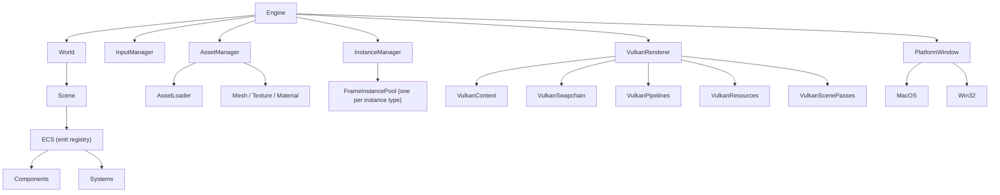
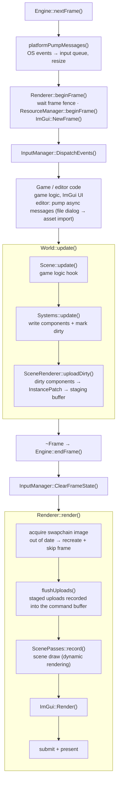
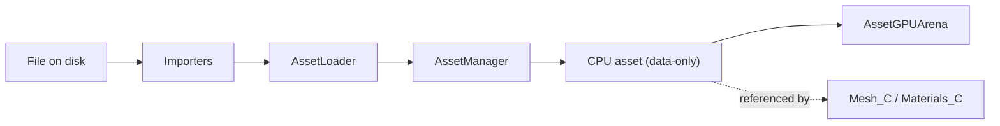
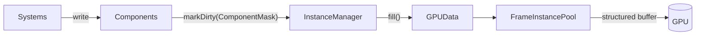

# Engine

## Architecture

---
## **Frame Life Cycle**

The game loop is `while (Frame frame = engine.nextFrame()) { ...; world.update(); }` — the `Frame` destructor triggers `endFrame()`.

---
## Asset Manager

**Purpose**  

- Manage asset lifetime on CPU  
- Bridge imported data and GPU resources  

**Properties**

- Assets are **data-only**
- Assets are **referenced**, never owned, by instances

**Examples**

- Mesh
- Texture
- Material data

**Import pipeline**

---

## ECS

**Overview**

- ECS stores **authoritative CPU-side data**
- Components represent state
- Systems implement logic

**Components**

- Stored in `src/Components`
- Ideally **data-only** (small helper logic allowed)
- Source of truth
- **No direct GPU access**
- Mutations must occur inside a **System**
- GPU-relevant writes outside systems must use `Scene::write<Component>()`
- Direct `entt::registry::get / try_get` **bypasses dirty tracking**

**Systems**

- Stored in `src/Systems`
- Ideally **pure logic**
- Read/write components
- Mark components dirty when GPU sync is required

**Rules**

- Systems do **not** access GPU resources
- Systems do **not** own data
- Systems operate only on ECS state

---

## GPU Instances / Instance Manager / Declaration

**Instance Manager**

- Owns multiple `FrameInstancePool<T>`
- One pool per instance type (Camera, Mesh, ...)

**FrameInstancePool**

- One structured GPU buffer + SRV per pool
- Contiguous CPU-side pool
- Entity → Instance mapping
- Supports resize and recycling

### GPU Instance

**Purpose**

- Represent ECS entities in a GPU-friendly format
- Synchronize ECS data to GPU buffers
- Support multi-frame-in-flight rendering

**Defines**

- **Used ECS components**: `Uses` (its head is the marker component)
- **GPU memory layout**: `GPUData`
- **CPU → GPU fill rules**: `fill()`

**Constraints**

- `GPUData` must be **trivially copyable**
- GPU-compatible alignment
- No pointers or ownership
- No direct GPU access

**ECS → GPU sync**

